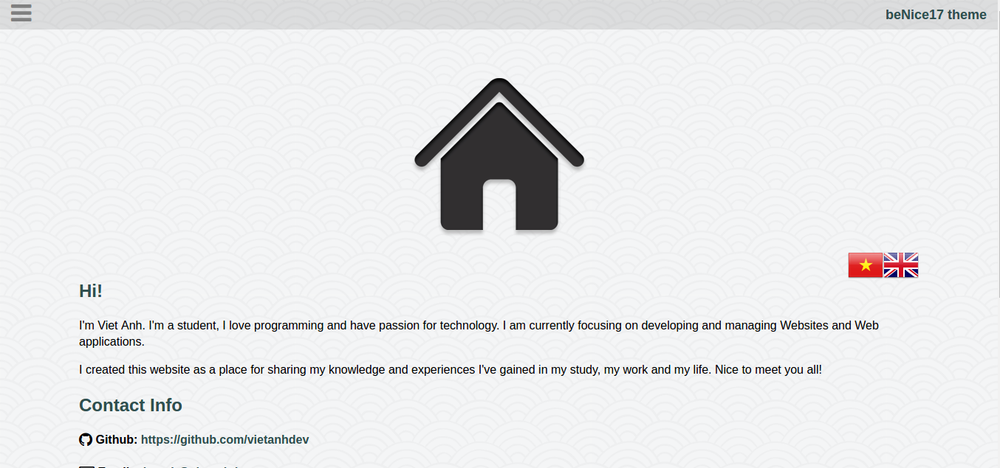
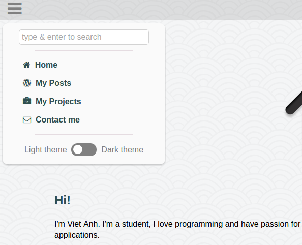
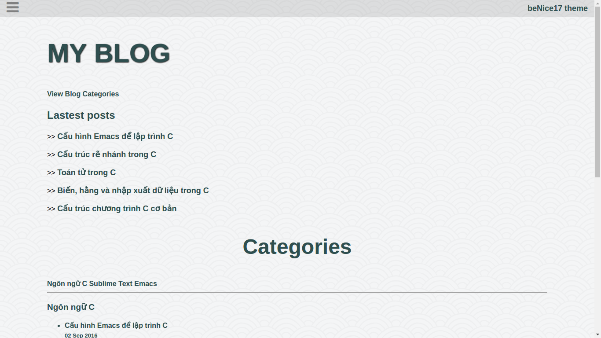
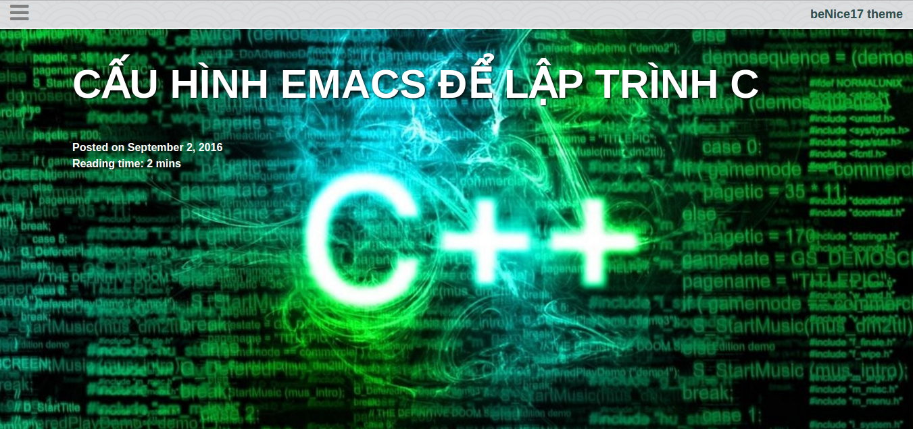
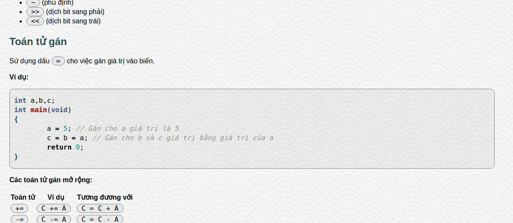
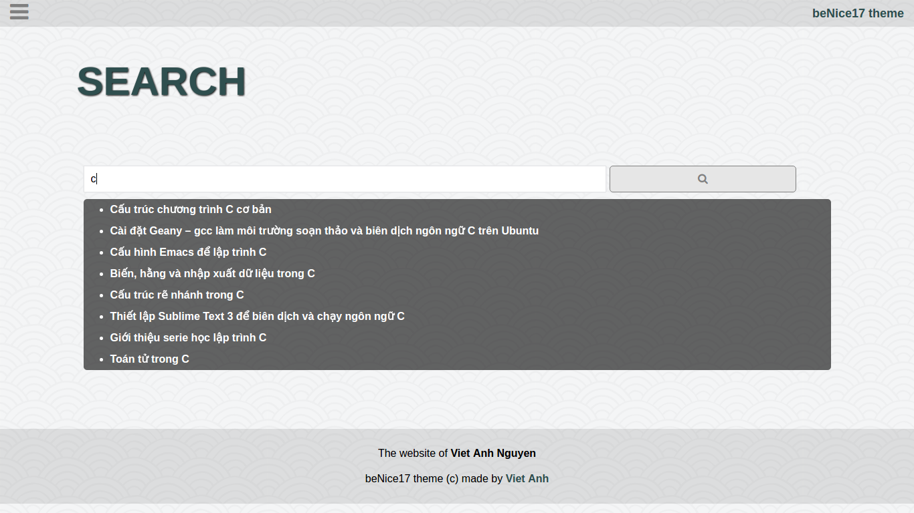

# beNice17
A very light, simple and responsive jekyll theme. Suitable for personal websites and blogs.

## Demo: https://vietanhdev.com/beNice17/

## To use this theme
- Fork this theme to your Github account.
- Rename the repository. (Eg: If your Github username is vietanhdev, rename the repository to vietanhdev.github.io).
- Edit `_config.yml` file to change your site url and other settings.
- Edit `/html_includes/head/topbar-menu.html` if you want to change menu.
- Enter your site at `<your-username>.github.io`.

## Note:
- Read more about Jekyll at https://jekyllrb.com/ to fully configure your website.
- You can contact me for more support: benice17@vietanhdev.com

## Some screenshots:

- Homepage

- Menu

- Post list

- Big header image

- Code highlight

- Search page

